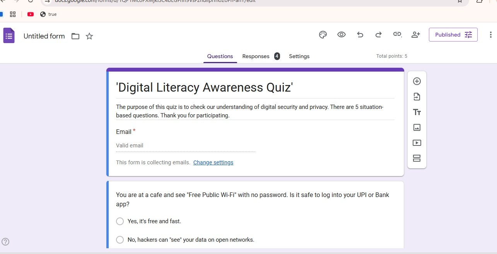
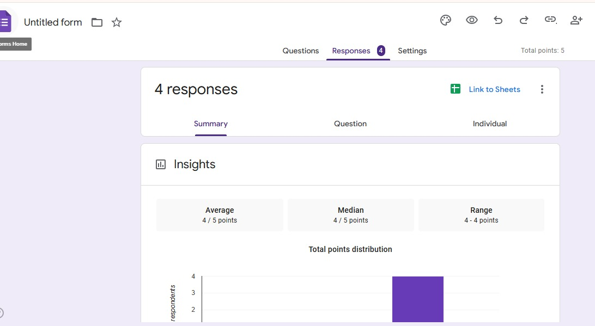

# 📊 Task 3: Survey Forms & Data Management

This section of the portfolio focuses on digital data collection and platform integration. I have created a functional survey form to gather data and linked it to a live spreadsheet for real-time response tracking.

## 🔗 Live Form Link
You can view and interact with the live form here:
👉 **Click here to open the Google Form:-https://forms.gle/3mzP8w8yTH2epNBs7**

---

## 📸 Form & Response Preview

### 1. Survey Form Design
This is the user-facing view of the form designed to collect structured data.

### 2. Google Sheets (Response View)
This sheet is automatically updated whenever a new response is submitted, demonstrating seamless data integration.

---

## 🛠️ Tools Used
* **Google Forms:** For creating the survey interface.
* **Google Sheets:** For backend data storage and analysis.
* **GitHub:** For hosting the project documentation and screenshots
